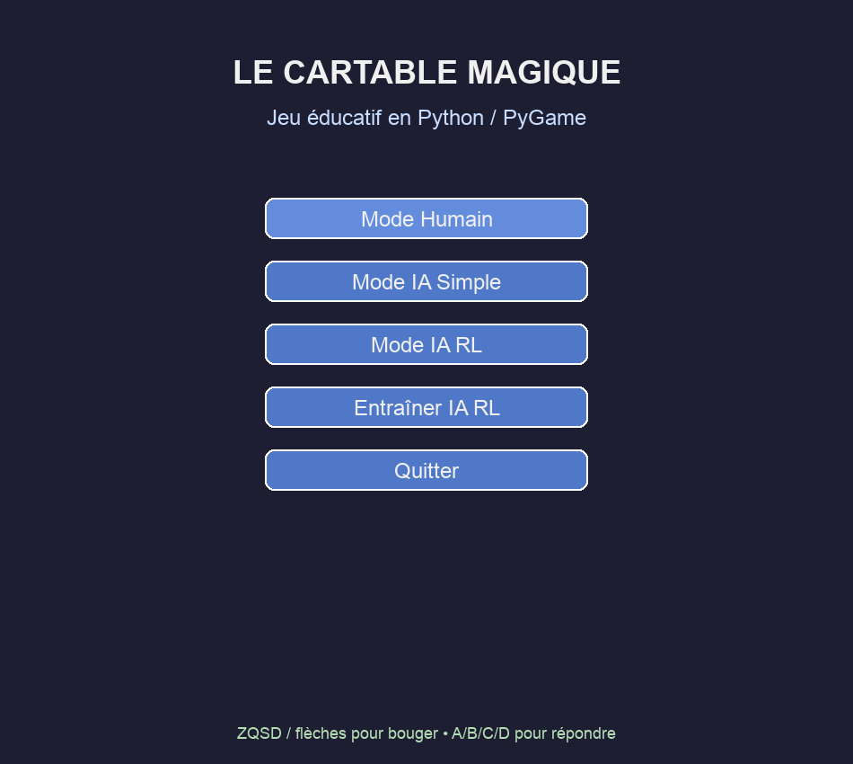
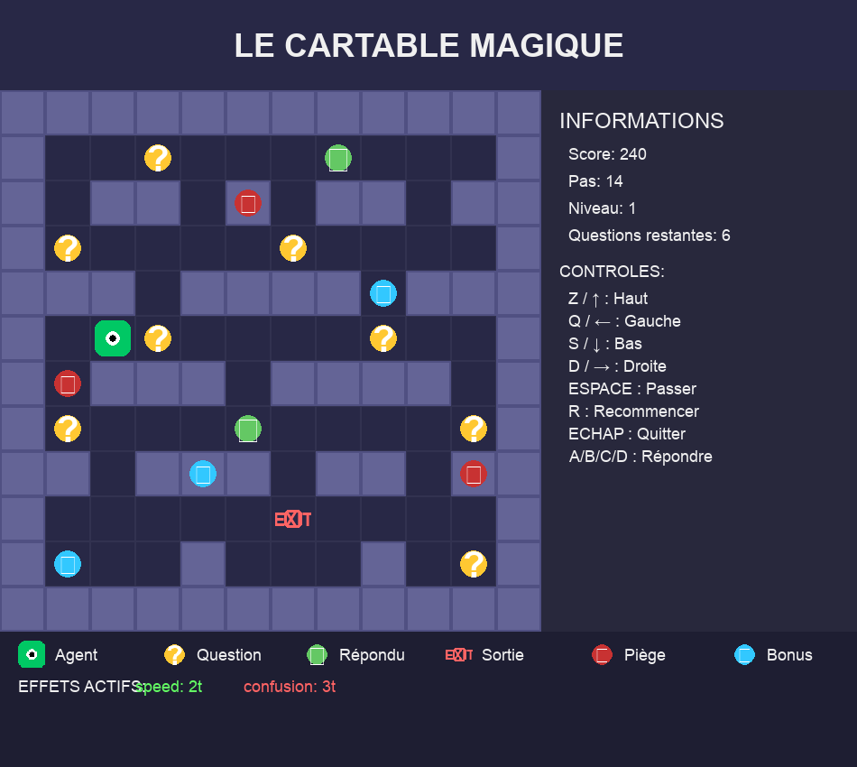

# Le Cartable Magique

Jeu éducatif en Python/PyGame inspiré d’un labyrinthe à thème scolaire. Le joueur avance dans un monde de cartes, répond à des questions et évite les pièges tout en collectant des bonus.

Le projet inclut aussi un mode d’IA simple et un mode d’IA RL (apprentissage par renforcement) pour expérimenter des comportements autonomes.

## Fonctionnalités

- Labyrinthe jouable en solo
- Questions à choix multiples
- Pièges et bonus dynamiques
- Interface PyGame
- Mode IA simple
- Mode IA RL
- Entraînement de l’agent

## Captures d’écran





Pour régénérer ces captures localement :

```bash
python3 generate_screenshots.py
```

## Prérequis

- Python 3.9+
- pip

## Installation

```bash
cd rl_education_game2
python3 -m venv .venv
source .venv/bin/activate
python -m pip install --upgrade pip
python -m pip install -r requirements.txt
python -m pip install pygame
```

## Lancer le projet

```bash
python main_game.py
```

## Contrôles

- Z / ↑ : Haut
- Q / ← : Gauche
- S / ↓ : Bas
- D / → : Droite
- A / B / C / D : Répondre aux questions
- Espace : passer / menu
- R : recommencer
- M : retour au menu
- Échap : quitter

## Structure du projet

- `main_game.py` : point d’entrée du jeu
- `game_ui.py` : interface PyGame
- `environment.py` : logique du monde / environnement
- `agent.py` : agent basique
- `rl_agent.py` : agent d’apprentissage renforcé
- `questions_db.py` : base des questions
- `traps.py` : pièges et bonus
- `sounds.py` : gestion des effets sonores
- `train.py` : entraînement de l’IA
- `test_*.py` : tests du projet


